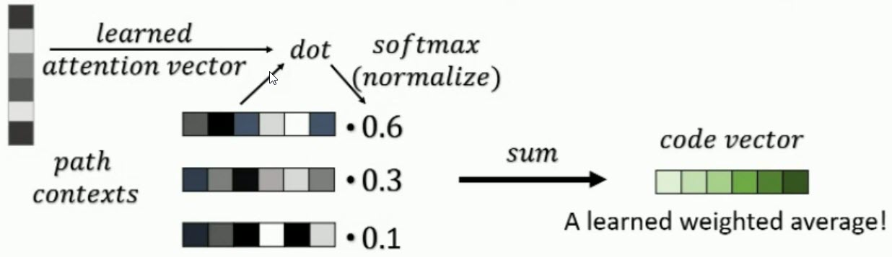
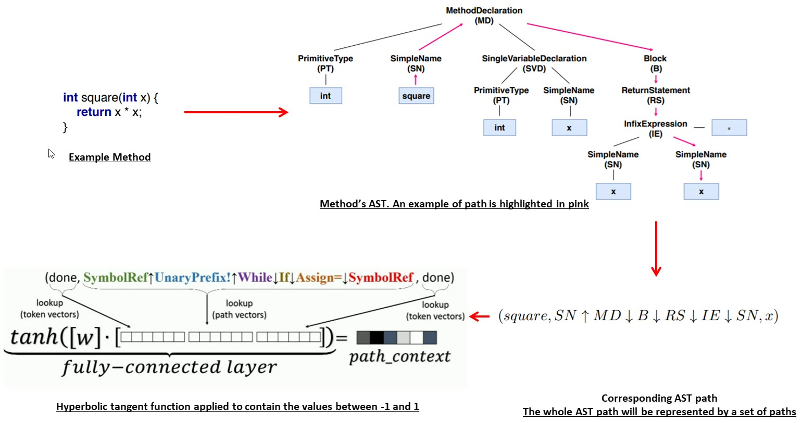

# Predicting method names using code semantics
The problem that we want to solve is to predict an appropriate method name based on the semantics of a code snippet. Particularly, we will be focusing on simple methods written in Python. This problem solves an essential part of the software code review process where the reviewers look for good naming of methods when reviewing code.
The data that we would be using to solve this problem is CodeSearchNet corpus [1], which is programmatically obtained by scraping open-source GitHub repositories [2]. The data is stored in jsonlines format and we will be using the method name and the code snippet attributes of the JSON values. The authors claim in [1] that the scraped data is noisy. If we find that the dataset is taking more time to make it usable, we will resort to the dataset used by the [3] authors [4].
This is a supervised, regression problem where we are predicting method name given its body. The approach we are taking to solve this problem is that we will produce vector embeddings that capture properties of snippets of code, such that similar snippets (according to any desired criteria) are assigned similar vectors. This is achieved using the following steps [7], shown in Figure 1:
1. Extracting syntactic paths from within a code snippet, representing them as a bag of distributed vector representations. (Path Contexts)
2. Using an attention mechanism to assign an importance to each code path. (Learned Attention Vector)
3. From the Path Contexts and Learned Attention Vector, producing a single vector that this code snippet is mapped onto. (Code Vector)

We will use a deep learning approach for training during which the values of these vectors as well as the attention value of each path is learned. We will use an open-source library [5] for mining path-based representation of code called PathMiner [6]. This path-based representation models a snippet of code as a collection of paths between the nodes in its abstract syntax tree (AST). An example is shown in Figure 2.

Learned attention vector is initialized randomly and updated and trained with the rest of the network during the training phase. To compute weights in the weighted average, we take a dot product between the learned attention vector and the path contexts, normalize it using soft-max method, then multiply each path context vector by its normalized score. Finally, we sum these weighted vectors and get a single code vector. We will use an additional set of method name vectors for every possible method name that we observed in the training data and we use the code vector to predict the target method name.
For prototyping, we will be using an Intel Core i5 CPU 3.4 Ghz, 16 GB RAM PC, Colab and may be other available resources. GPUs may be needed for training. The final deliverable will  be a web service with an API that allows a client to send code snippets and receive a prediction as a response. Also, we will have a basic web frontend having a text box for typing/ pasting code snippets and a text block to show the prediction.

[1] https://arxiv.org/pdf/1909.09436.pdf

[2] https://s3.amazonaws.com/code-search-net/CodeSearchNet/v2/python.zip

[3] http://doi.acm.org/10.1145/3290353

[4] https://s3.amazonaws.com/code2vec/data/java14m_data.tar.gz

[5] https://github.com/vovak/astminer

[6] https://zenodo.org/record/2595271#.XbW066JKhaQ

[7] https://www.youtube.com/watch?v=4j8mif-ybyw