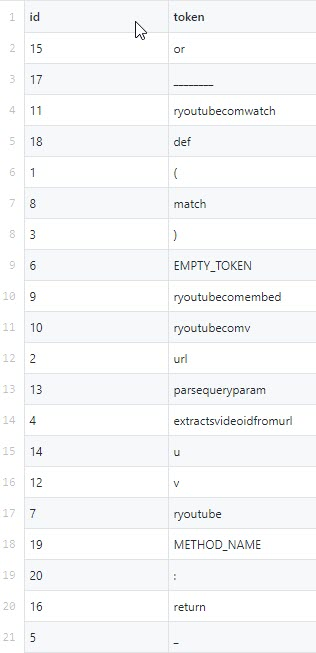

### Explanation of the Results

The command to generate these results is:
java -jar cli.jar code2vec --methodContent $'def square(x):\n    return x*x'

It correctly converts the \n to a new line in the input due to the use of $'....' notation.

The output files show the correct token for this case.

If we add the docstrings to the input i.e. the command:
java -jar cli.jar code2vec --methodContent $'def square(x):\n    """Calculates squared value.\n    """\n    return x*x'

It has one more token 'calculatessquaredvalue' which is basically the docstring with the spaces stripped. I don't think that this should be a token, but I have to confirm. This also means we have two additional entries in the node types file, one for the up direction and one for the down direction and several more entries in the paths file.

If we try another example, a real example for a top starred github repository here https://github.com/soimort/you-get/blob/b746ac01c9f39de94cac2d56f665285b0523b974/src/you_get/extractors/youtube.py#L135-L143

The command will be this:
java -jar cli.jar code2vec --methodContent $'def get_vid_from_url(url):\n        """Extracts video ID from URL.\n        """\n        return match1(url, r\'youtu\\.be/([^?/]+)\') or \\\n          match1(url, r\'youtube\\.com/embed/([^/?]+)\') or \\\n          match1(url, r\'youtube\\.com/v/([^/?]+)\') or \\\n          match1(url, r\'youtube\\.com/watch/([^/?]+)\') or \\\n          parse_query_param(url, \'v\') or \\\n          parse_query_param(parse_query_param(url, \'u\'), \'v\')'

The results show the following tokens:

