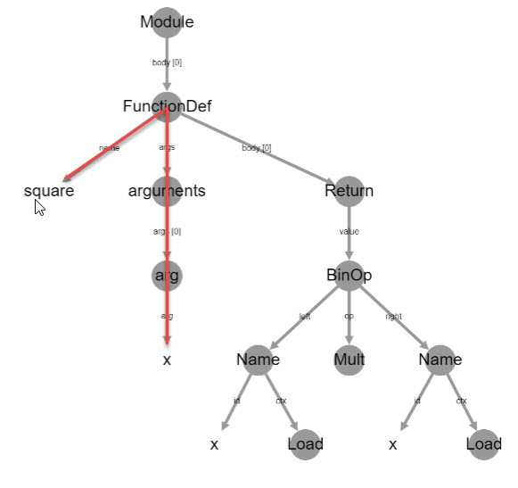

### Method
As an example, consider the following method:

### Abstract syntax tree
The abstract syntax tree representation of the method is generated using [1] and is shown below:

### Token vocabulary
The token vocabulary emitted by the Astminer. Each token is associated with a unique token id.

### Node type vocabulary
The node type vocabulary emitted by the Astminer. Each node type along with a direction is associated with a unique node type id.

### Path vocabulary
The path vocabulary emitted by the Astminer. Paths are stored as sequences of node type ids.

### Path contexts
Path-contexts are encoded as (start token id, path id, end token id).

So, for the following abstract syntax tree path.

We are looking for the path-context having METHOD_NAME as the start token id and x as the end token id.

The path-context encoding is 9,30,2.

30 is the path id whose value is 32 27 28 3 4, where 32 is NAME UP, 27 is stmt|compound_stmt|funcdef UP, 28 is stmt|compound_stmt|funcdef DOWN, 3 is parameters DOWN and 4 is typedargslist|tfpdef|NAME DOWN.

References:
[1] https://ast-viewer.datacamp.com/editor