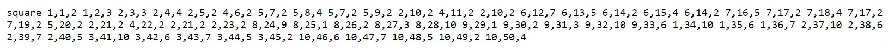

### Method
As an example, consider the following method:

### Abstract syntax tree
The abstract syntax tree representation of the method is:

### Token vocabulary
The token vocabulary emitted by the Astminer. Each token is associated with a unique token id.

### Node type vocabulary
The node type vocabulary emitted by the Astminer. Each node type along with a direction is associated with a unique node type id.

# Path vocabulary
The path vocabulary emitted by the Astminer. Paths are stored as sequences of node type ids.

# Path contexts
Path-contexts are encoded as (start token id, path id, end token id)

